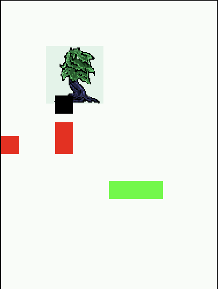
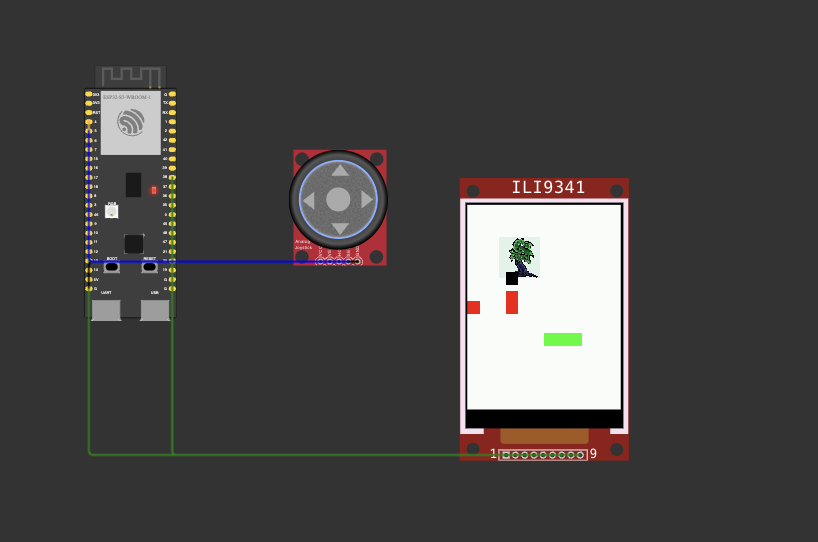

```markdown
# ESP32 ILI9341 Joystick Game

A tiny demo game for ESP32 + ILI9341 display, controllable with a joystick.  
Test it live in [Wokwi](https://wokwi.com/)!

## 📦 Structure

```
.
├── assets/
│   ├── game-demo.png
│   └── game-demo-full.png
├── components/   # your game_lib, display, joystick, etc.
├── main/         # app_main.c
└── CMakeLists.txt
```

## ⚙️ Prerequisites

- [ESP-IDF](https://docs.espressif.com/projects/esp-idf/en/latest/esp32/get-started/)
- Wokwi ESP32 + ILI9341 + joystick peripheral

## ▶️ How to Run

1. **Locally**  
   ```bash
   git clone <your-repo>
   cd your-repo
   idf.py set-target esp32
   idf.py flash monitor
   ```
2. **In the browser**  
   - Open the `.wokwi` file in Wokwi and hit ▶️  

## 🖼 Screenshots

  
*Basic movement and obstacles.*

  
*Joystick + ILI9341 in action on Wokwi.*
```

